# Service Architecture Presentation

เอกสารนี้ใช้สำหรับอธิบาย diagram การเชื่อมต่อของระบบ Blog API ที่ deploy ด้วย Docker, Nginx, MongoDB และ Cloudflare

## Architecture Diagram

```mermaid
flowchart LR
    user["User / Browser / Postman"]
    cloudflare["Cloudflare DNS<br>A Record: api.zxcvbn.online -> 13.213.19.183"]
    server["AWS EC2 Server<br>Public IP: 13.213.19.183<br>Inbound HTTP port 80"]
    nginx["Nginx Container<br>Public entrypoint<br>Host 80 -> Container 80"]
    api["Blog API Container<br>Express.js / Node.js<br>Internal port 4000"]
    mongo["MongoDB Container<br>Database<br>Internal port 27017"]
    volume["Docker Volume<br>mongo-data<br>Persistent storage"]

    user -->|"HTTP request"| cloudflare
    cloudflare -->|"Resolve domain to server IP"| server
    server -->|"Port 80"| nginx
    nginx -->|"Reverse proxy to api:4000"| api
    api -->|"Read / write posts data"| mongo
    mongo -->|"Store data permanently"| volume

    subgraph dockerNetwork["Docker network: api_network"]
        nginx
        api
        mongo
    end
```



## Short Explanation

ระบบนี้ทำให้ผู้ใช้เรียก API ผ่าน domain `api.zxcvbn.online` ได้ โดย request จะวิ่งจากผู้ใช้ไปที่ Cloudflare DNS ก่อน จากนั้น Cloudflare จะชี้ไปยัง IP ของ server คือ `13.213.19.183` แล้ว request จะเข้า Nginx container ที่ port 80

Nginx ทำหน้าที่เป็น reverse proxy รับ request จากภายนอก แล้วส่งต่อเข้า Blog API container ที่อยู่ข้างใน Docker network ผ่าน address `api:4000`

Blog API จะประมวลผล endpoint ต่าง ๆ เช่น `/health`, `/posts`, `/posts/:id/view` และ `/analytics/top-posts` แล้วอ่านหรือเขียนข้อมูลลง MongoDB container ผ่าน address `mongo:27017`

MongoDB เก็บข้อมูลจริงไว้ใน Docker volume ชื่อ `mongo-data` ทำให้ข้อมูลไม่หายแม้ container ถูก restart

## Detailed Flow

### 1. User ส่ง request เข้า domain

ผู้ใช้เปิด browser หรือใช้ Postman เรียก:

```text
http://api.zxcvbn.online/health
```

หรือ:

```text
http://api.zxcvbn.online/posts
```

ตรงนี้ผู้ใช้ไม่จำเป็นต้องรู้ว่า server จริงอยู่ที่ไหน เพราะใช้ domain เป็นตัวแทน

### 2. Cloudflare แปลง domain เป็น IP server

ใน Cloudflare มี DNS record แบบ A Record:

```text
Type: A
Name: api
Content: 13.213.19.183
Proxy status: DNS only
TTL: Auto
```

แปลว่าเมื่อมีคนเข้า `api.zxcvbn.online` ระบบ DNS จะพา request ไปที่ server IP `13.213.19.183`

### 3. Request เข้า server ผ่าน port 80

บน AWS EC2 server มีการเปิด inbound rule สำหรับ HTTP:

```text
Protocol: TCP
Port: 80
Source: 0.0.0.0/0
```

ทำให้ request จาก internet สามารถเข้ามาที่ server ผ่าน port 80 ได้

### 4. Nginx container รับ request จากภายนอก

ใน `docker-compose.yml` service `nginx` map port แบบนี้:

```yaml
ports:
  - "80:80"
```

หมายความว่า:

```text
Server port 80 -> Nginx container port 80
```

ดังนั้น Nginx เป็นจุดแรกใน Docker ที่รับ request จากภายนอก

### 5. Nginx reverse proxy ไปหา API

ไฟล์ `nginx/default.conf` ตั้งค่าไว้ว่า:

```nginx
server {
    listen 80;
    server_name api.zxcvbn.online;

    location / {
        proxy_pass http://api:4000;
    }
}
```

ส่วนสำคัญคือ:

```text
proxy_pass http://api:4000;
```

คำว่า `api` คือชื่อ service ของ API container ใน Docker Compose ไม่ใช่ domain ข้างนอก และไม่ใช่ localhost

เพราะ `nginx` กับ `api` อยู่ใน Docker network เดียวกันชื่อ `api_network` จึงเรียกกันด้วย service name ได้

### 6. API container ประมวลผล request

Blog API เป็น Node.js / Express API ที่ expose port ภายใน container:

```yaml
expose:
  - "4000"
```

API นี้ไม่ได้เปิด port 4000 ออก internet โดยตรง ภายนอกจึงเข้า API ผ่าน Nginx เท่านั้น

ตัวอย่าง endpoint:

```text
GET /health
GET /posts
POST /posts
GET /posts/:id
DELETE /posts/:id
POST /posts/:id/view
GET /analytics/top-posts
```

### 7. API ติดต่อ MongoDB ผ่าน Docker network

API ใช้ environment variable:

```text
MONGODB_URI=mongodb://mongo:27017
```

คำว่า `mongo` คือชื่อ service ของ MongoDB container ใน Docker Compose

การเชื่อมต่อจึงเป็น:

```text
API container -> mongo:27017 -> MongoDB container
```

ไม่ใช้ `localhost` เพราะในโลกของ container คำว่า `localhost` หมายถึง container ตัวเอง

### 8. MongoDB เก็บข้อมูลลง Docker Volume

MongoDB ผูก volume ไว้:

```yaml
volumes:
  - mongo-data:/data/db
```

ข้อมูล posts จะถูกเก็บไว้ใน volume `mongo-data`

ข้อดีคือถ้า container restart หรือ recreate ข้อมูลยังอยู่ ไม่หายเหมือน in-memory storage

## Why This Architecture

### Nginx เป็น public entrypoint

Nginx เป็น container เดียวที่เปิด port ออก internet ทำให้ควบคุม request จากภายนอกได้ง่ายกว่าเปิด API ออกโดยตรง

### API ไม่ถูกเปิดออก internet ตรง ๆ

API อยู่ภายใน Docker network และเปิดแค่ internal port 4000 ลด surface ที่คนภายนอกเข้าถึงได้

### MongoDB ไม่ถูกเปิดออก internet

MongoDB ไม่มี public port mapping จึงเข้าได้จาก container ใน `api_network` เท่านั้น ปลอดภัยกว่าการเปิด database port ออก internet

### Docker network ทำให้ service คุยกันด้วยชื่อ

ใน network `api_network` container สามารถเรียกกันด้วย service name เช่น:

```text
nginx -> api:4000
api -> mongo:27017
```

ไม่ต้องจำ IP ภายใน container เพราะ Docker จัดการ DNS ภายใน network ให้

### Docker volume ทำให้ข้อมูล persist

MongoDB เก็บข้อมูลไว้ใน volume แยกจากตัว container ทำให้ข้อมูลไม่หายเมื่อ restart หรือ rebuild container

## Request Flow Example

ตัวอย่างเมื่อผู้ใช้เรียก:

```text
GET http://api.zxcvbn.online/posts
```

ลำดับการทำงานคือ:

1. Browser ขอ DNS ของ `api.zxcvbn.online`
2. Cloudflare ตอบกลับเป็น IP `13.213.19.183`
3. Browser ส่ง HTTP request ไปที่ `13.213.19.183:80`
4. AWS EC2 security group อนุญาตให้ request เข้า port 80
5. Nginx container รับ request ที่ port 80
6. Nginx proxy request ไปที่ `api:4000`
7. API container รับ request ที่ endpoint `/posts`
8. API query ข้อมูลจาก MongoDB ที่ `mongo:27017`
9. MongoDB อ่านข้อมูลจาก volume `mongo-data`
10. API ส่ง JSON response กลับไปทางเดิม
11. Browser ได้ข้อมูล posts กลับมา

## Verification Evidence

ทดสอบจากใน server:

```bash
curl http://localhost/health
```

ผลลัพธ์:

```json
{"ok":true}
```

ทดสอบจาก domain:

```text
http://api.zxcvbn.online/health
```

ผลลัพธ์:

```json
{"ok":true}
```

ผลลัพธ์นี้ยืนยันว่า flow ทำงานครบ:

```text
Cloudflare DNS -> Server port 80 -> Nginx -> API -> MongoDB
```

## Presentation Script

สำหรับระบบนี้ ผม deploy Blog API บน AWS EC2 โดยใช้ Docker Compose ในการจัดการ container ทั้งหมด ระบบประกอบด้วย 3 service หลักคือ Nginx, API และ MongoDB

ผู้ใช้จะเรียก API ผ่าน domain `api.zxcvbn.online` ซึ่งถูกตั้งค่าใน Cloudflare ด้วย A Record ให้ชี้ไปที่ IP ของ server คือ `13.213.19.183`

เมื่อ request เข้ามาที่ server ผ่าน port 80 Nginx container จะเป็นตัวรับ request ก่อน จากนั้น Nginx จะ reverse proxy ไปที่ API container ผ่าน internal address `api:4000`

API container เป็น Express.js service ที่จัดการ logic ของ Blog API เช่นสร้าง post, ดึง post, ลบ post, เพิ่ม view และดู top posts

เมื่อ API ต้องการอ่านหรือเขียนข้อมูล จะเชื่อมต่อไปยัง MongoDB container ผ่าน address `mongo:27017` ภายใน Docker network ชื่อ `api_network`

MongoDB จะเก็บข้อมูลลง Docker volume ชื่อ `mongo-data` เพื่อให้ข้อมูลยังอยู่แม้ container restart

จุดสำคัญของ architecture นี้คือภายนอกเข้าถึงได้เฉพาะ Nginx ที่ port 80 ส่วน API และ MongoDB อยู่ภายใน Docker network ทำให้ระบบเป็นระเบียบและปลอดภัยกว่าเปิดทุก service ออก internet โดยตรง

สุดท้ายผมทดสอบแล้วว่า endpoint `http://api.zxcvbn.online/health` ตอบกลับ `{"ok":true}` แปลว่าการเชื่อมต่อครบตั้งแต่ Cloudflare, Server, Nginx, API ไปจนถึงระบบภายใน Docker ทำงานสำเร็จ
