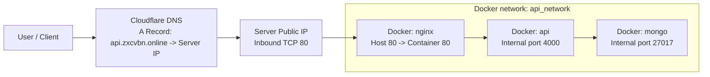

# Service Deploy: API + MongoDB + Nginx + Cloudflare

เอกสารนี้อธิบาย flow การ deploy API ใน Docker container, ต่อ MongoDB ผ่าน Docker network ชื่อ `api_network`, เปิด public port `80` ผ่าน Nginx, แล้ว map domain จาก Cloudflare มายัง IP server

> Domain ที่ตั้งไว้ใน config ตอนนี้คือ `api.zxcvbn.online` ถ้าจะใช้ domain อื่นให้แก้ที่ `nginx/default.conf`

## สิ่งที่ทำไว้ในโปรเจกต์นี้แล้ว

- ปรับ `docker-compose.yml` ให้มี service `api`, `mongo`, และ `nginx`
- ให้ service `api` ใช้ image `sirawit17766/portfolio-blog-api:latest` จาก Docker Hub และยัง build จาก `Dockerfile` ได้ถ้ารัน `--build`
- สร้าง Docker network ชื่อ `api_network`
- ให้ API ต่อ MongoDB ด้วย host ภายใน Docker network: `mongodb://mongo:27017`
- ให้ Nginx รับ request จาก host port `80` แล้ว reverse proxy ไปที่ `api:4000`
- ซ่อน MongoDB ไม่ให้ expose port ออกนอก server
- สร้าง config Nginx ที่ `nginx/default.conf`
- เพิ่ม diagram การเชื่อมต่อในเอกสารนี้

## สิ่งที่คุณต้องทำเอง

- มี server ที่ติดตั้ง Docker และ Docker Compose แล้ว
- ชี้ Cloudflare A Record จาก domain/subdomain ไปยัง public IP ของ server
- เปลี่ยน `server_name` ใน `nginx/default.conf` ถ้าจะใช้ domain อื่นจาก `api.zxcvbn.online`
- ถ้ามี firewall บน server ต้องเปิด inbound TCP port `80`
- ถ้าใช้ production จริง แนะนำเพิ่ม HTTPS ด้วย Cloudflare หรือ Certbot ภายหลัง

## 1. Run images บน Docker container ใน server

บน server ให้ clone หรือ upload โปรเจกต์นี้ แล้วรัน:

```bash
docker compose up -d --build
```

ถ้าจะใช้ image ที่ publish แล้วจาก Docker Hub โดยไม่ build ใหม่ ให้รัน:

```bash
docker compose pull
docker compose up -d
```

ตรวจ container:

```bash
docker compose ps
```

ควรเห็น:

- `portfolio-blog-nginx`
- `portfolio-blog-api`
- `portfolio-blog-mongo`

## 2. API เชื่อมต่อ Database ผ่าน `api_network`

ใน `docker-compose.yml` ทุก service อยู่ใน network เดียวกัน:

```yaml
networks:
  api_network:
    name: api_network
```

API ใช้ connection string ภายใน Docker:

```text
mongodb://mongo:27017
```

คำว่า `mongo` คือชื่อ service ใน Docker Compose ไม่ใช่ localhost

## 3. Map port public ออกไปที่ port 80

production setup นี้ให้ Nginx เป็น service เดียวที่ map port ออก host:

```yaml
ports:
  - "80:80"
```

ส่วน API ไม่เปิด port ออกข้างนอก แต่เปิดให้ container อื่นใน network เรียกผ่าน:

```yaml
expose:
  - "4000"
```

หมายเหตุ: ถ้า map API ตรงเป็น `80:4000` พร้อมกับ Nginx `80:80` จะชน port กัน จึงให้ Nginx เป็น public entrypoint แล้ว proxy เข้า API แทน

## 4. Map IP server ที่ Cloudflare

ใน Cloudflare DNS ให้สร้าง record:

```text
Type: A
Name: api
Content: YOUR_SERVER_PUBLIC_IP
Proxy status: DNS only หรือ Proxied
TTL: Auto
```

ตัวอย่างของโปรเจกต์นี้:

```text
A | api.zxcvbn.online | YOUR_SERVER_PUBLIC_IP
```

ตัวอย่างทั่วไป:

```text
A | api.yourdomain.com | 188.188.188.1
```

ถ้าเปิด Cloudflare proxy สีส้มไว้ request จะผ่าน Cloudflare ก่อนเข้า server ถ้าใช้ DNS only request จะวิ่งตรงเข้า server

## 5. Nginx container reverse proxy เข้า API

ไฟล์ config อยู่ที่:

```text
nginx/default.conf
```

config ตอนนี้:

```nginx
server_name api.zxcvbn.online;
```

ถ้าจะเปลี่ยนเป็น domain อื่น ให้แก้เป็น:

```nginx
server_name api.yourdomain.com;
```

Nginx ส่ง request ไป API ภายใน network:

```nginx
proxy_pass http://api:4000;
```

หลังแก้ config ให้ reload container:

```bash
docker compose restart nginx
```

## 6. ทดสอบการเชื่อมต่อ

ทดสอบจากตัว server ก่อน:

```bash
curl http://localhost/health
```

ผลลัพธ์ที่ควรได้:

```json
{"ok":true}
```

ทดสอบแบบใส่ Host header ก่อน DNS พร้อม:

```bash
curl -H "Host: api.zxcvbn.online" http://127.0.0.1/health
```

หลัง Cloudflare DNS ชี้มาถูกแล้ว ทดสอบจากเครื่องคุณ:

```bash
curl http://api.zxcvbn.online/health
curl http://api.zxcvbn.online/posts
```

ถ้าข้อมูลแสดงออกมา แปลว่า Cloudflare -> Server -> Nginx -> API -> MongoDB ทำงานครบแล้ว

## 7. Diagram การเชื่อมต่อ



## Useful commands

ดู logs ทั้งหมด:

```bash
docker compose logs -f
```

ดู logs เฉพาะ API:

```bash
docker compose logs -f api
```

ดู logs เฉพาะ Nginx:

```bash
docker compose logs -f nginx
```

หยุด service:

```bash
docker compose down
```

หยุดและลบ database volume:

```bash
docker compose down -v
```

ใช้ `docker compose down -v` เฉพาะตอนต้องการลบข้อมูล MongoDB ทิ้งจริง ๆ
